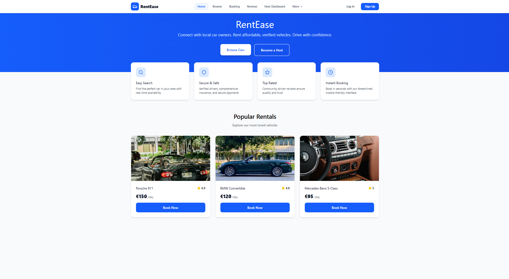
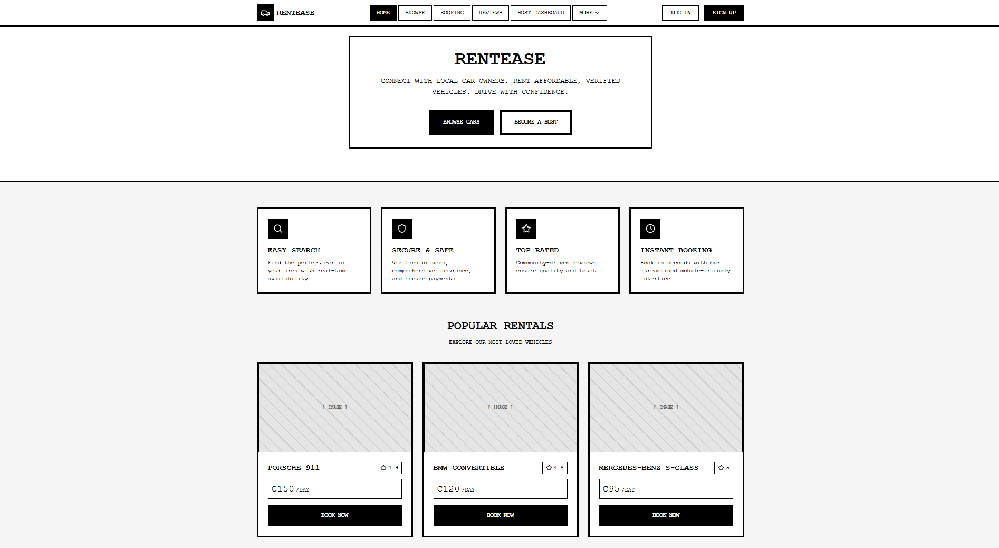

# RentEase - 4th_assignment

## Description

The platform features a comprehensive navigation system with primary routes (Home, Browse, Booking, Reviews, Host Dashboard) and secondary routes accessible through a "More" dropdown menu (Profile, My Rentals, Support & Safety).
The homepage includes a hero section with the RentEase branding and dual call-to-action buttons, a four-feature grid highlighting Easy Search, Secure & Safe transactions, Top Rated reviews, and Instant Booking capabilities, and a popular rentals showcase displaying three featured vehicles with pricing and booking options.

## [Link to high fidelity prototype](https://www.figma.com/make/lJmeQCebPL4dHE7VCz38ru/RentEase-Landing-Page-Design?t=ckWtyUba2wr1mipK-1)

## High-fidelity prototype

## Low-fidelity prototype

